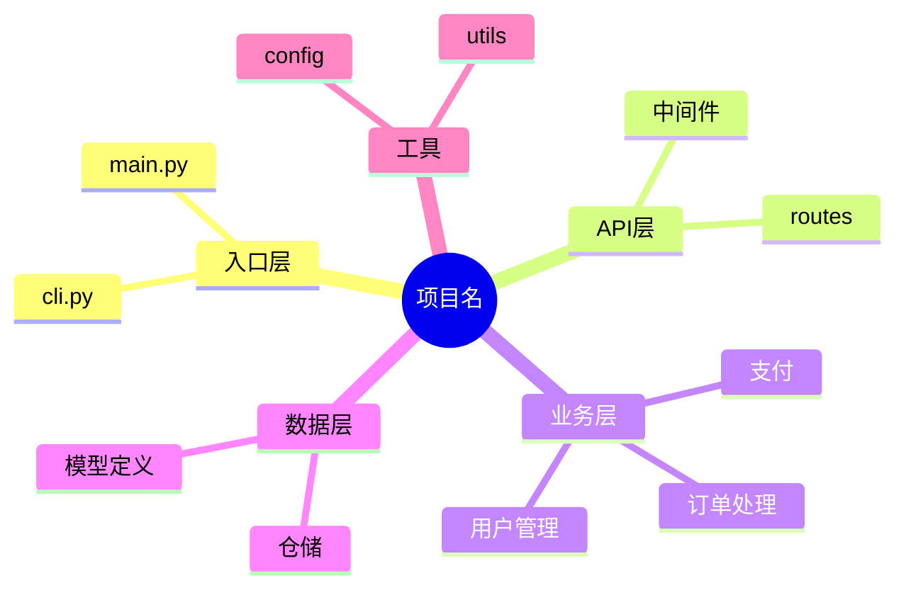

# 章节模板：完整展开版

> 所属技能：project-architecture

按需加载。撰写对应章节时，参照本文件的格式与结构要求。主文件中的"章节结构"一节保留了每章的核心约束，本文件提供完整模板与示例。

---

## 1. 项目概述

2-3 段话说明项目的业务背景、核心目标、整体技术定位。与 README 的项目简介不同，这里侧重"为什么要做这个项目"和"整体设计思路"。如果项目有明确的需求来源（如某业务痛点、某技术探索目标），应在此说明。

## 2. 系统架构

给出整体架构图（Mermaid），描述系统分层或服务划分。如果是分层架构，说明每层的职责、层间通信方式和数据流向；如果是微服务架构，说明各服务的职责、通信协议（REST / gRPC / 消息队列）和服务发现机制。架构图应让读者一眼看清系统的"骨架"。

## 3. 技术选型说明

用表格列出主要技术选型（框架、语言、数据库、中间件、第三方服务等），每项包含"技术名称""用途""选型理由"三列。选型理由应说明为什么选择该技术而非常见替代方案（例如"选择 Redis 而非 Memcached 是因为项目需要持久化和丰富的数据结构支持"）。如果某项选型存在争议或需要后续评估，用 `> 注意：xxx` 标注。

## 4. 目录结构详解

用树形文本（代码块包裹）展示完整目录结构，对每个核心目录和关键文件附加一行职责说明。说明应回答"这个目录/文件做什么"和"为什么放在这里"，而非简单复述文件名。格式示例：

```
src/
├── main.py            # 应用入口，负责初始化配置和启动服务
├── api/               # REST API 层，仅处理请求解析和响应格式化
├── service/           # 业务逻辑层，所有核心业务规则在此实现
├── model/             # 数据模型定义，ORM 实体和 DTO 均在此
└── utils/             # 通用工具函数，不包含业务逻辑
```

## 5. 模块设计

> **模块的定义**：模块 = 按功能职责划分的目录边界。一个模块对应一个核心功能目录，即"工程化目录"——目录结构本身就应当体现功能划分，而非按技术分层堆砌。

按模块逐一展开，每个模块包含以下子节（使用三级标题 `###`）：

- **模块职责**：一句话概括模块的核心职责
- **对外接口**：列出模块提供的公共 API、导出的函数/类、或对外暴露的消息主题
- **依赖关系**：列出该模块依赖的其他模块及被依赖情况
- **关键实现细节**：描述模块内部的重要设计模式、核心算法、或值得注意的数据结构选择。不需要罗列每一行代码，但应覆盖让读者理解模块设计的关键点

每个模块的描述控制在 150-300 字，超出时应考虑拆分为子模块。

### 嵌套模块

如果一个目录下存在多个功能独立、职责清晰的子目录（例如 `services/user/` 包含 `auth/`、`profile/`、`permission/`），则按层级拆分为父模块和子模块：

- 父模块：功能概述、依赖关系和总体职责
- 子模块：独立展开，遵守同样的"对外接口 / 依赖关系 / 关键实现细节"结构

例如：

```
### 用户管理模块

**模块职责**：所有用户相关功能的统一入口...

#### auth（认证子系统）
...
#### profile（个人信息子系统）
...
```

> 如果父模块内容少于 2 个有意义的段落，全部写在父模块中即可，不强制拆分。

## 6. 核心流程

选取 2-3 个关键业务流程（如用户注册、订单处理、数据同步等），用 Mermaid 时序图或流程图展示从入口到结束的完整调用链路。每个流程图附一段简要文字说明（100 字内），解释流程中的关键步骤和设计考量。

## 7. 数据模型

描述核心数据结构、数据库表设计（如适用）、关键实体之间的关系。如果是关系型数据库，给出 ER 图（Mermaid）；如果是 NoSQL，描述文档/键值结构。说明关键字段的设计考量（如"为什么用户表中将 email 和 username 分开存储"）。

## 8. 配置与部署

说明项目的运行环境要求、配置文件组织方式、环境变量清单，以及部署拓扑（单机 / 集群 / 云原生）。可附部署架构图（Mermaid）。如果项目使用了 CI/CD，简述流水线的阶段和触发条件。

## 9. 扩展与二次开发指南

面向需要在本项目基础上进行二次开发的开发者，说明如何添加新功能模块、新接口、新数据源等。给出 1-2 个典型扩展场景的步骤示例（如"添加一个新的 REST API 端点"、"接入一个新的数据源"），每个示例包含需要修改的文件和需要遵循的约定。

## 10. 设计决策记录

列出 3-5 个项目中关键的技术决策，每项使用 blockquote 格式，包含：决策内容、考虑过的备选方案、最终选择及理由、可能的后续影响。格式示例：

> **决策**：API 层采用 FastAPI 而非 Flask
> **备选方案**：Flask + marshmallow、Django REST Framework
> **选择理由**：FastAPI 提供原生异步支持、自动 OpenAPI 文档生成、基于 Pydantic 的类型校验，这三项在本项目中均为刚需
> **可能影响**：团队成员需要学习 FastAPI 的依赖注入模式；未来如果 WebSocket 需求增加，FastAPI 原生支持比 Flask 方案更有优势

---

## Mermaid 图示例

### 核心功能模块概览（mindmap，场景 A Step 1 用）



**降级方案**：如果 Mermaid mindmap 在当前环境下可能渲染不佳（如不支持 mindmap 语法），降级为带标记的目录树文本：

```
项目根目录/
├── src/
│   ├── main.py            # 入口
│   ├── api/               # [API 层] 路由和中间件
│   ├── service/
│   │   ├── user/          # [核心模块] 用户管理
│   │   ├── order/         # [核心模块] 订单处理
│   │   └── payment/       # [核心模块] 支付
│   ├── model/             # [数据层] 模型和仓储
│   └── utils/             # [工具] 工具函数和配置
```

### 元信息块（文档末尾，格式约束第 9 条）

```
---
> **文档元信息**
> 生成日期：YYYY-MM-DD
> 生成方式：基于代码库分析 / 基于项目描述 / 混合
> 代码版本/提交：commit-sha（基于代码库分析时）
> 项目类型：类型（见适配表）
> 写作模式：交互模式 / 一次性模式 / 快速骨架模式
```
